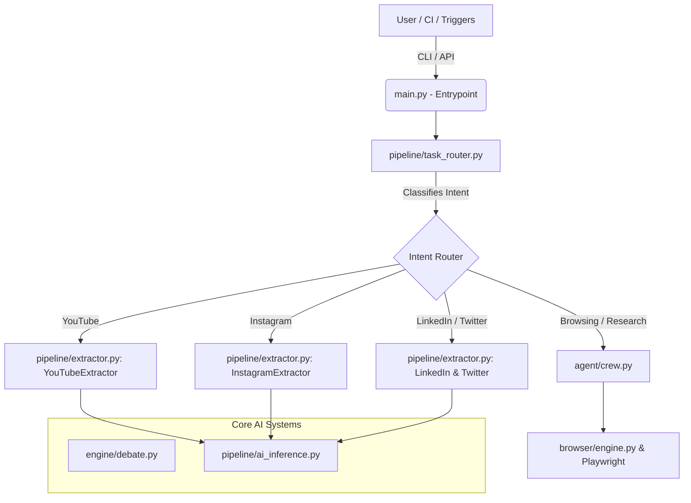
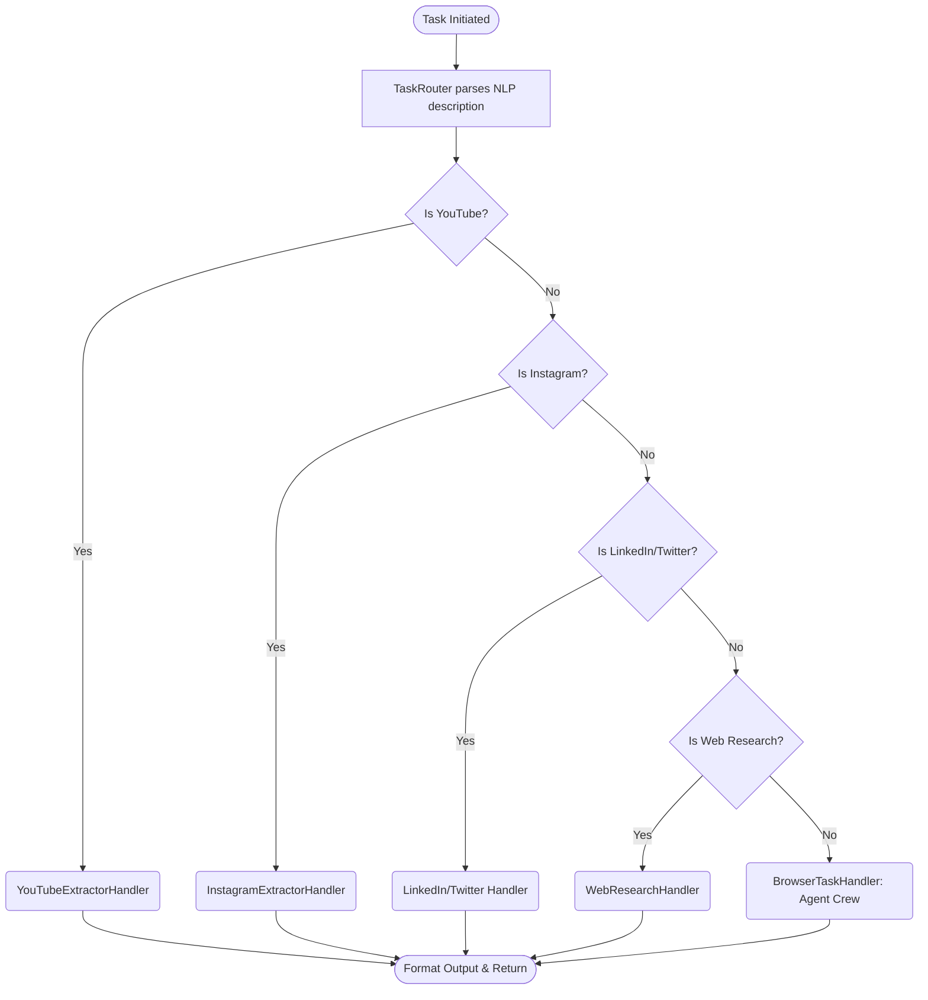
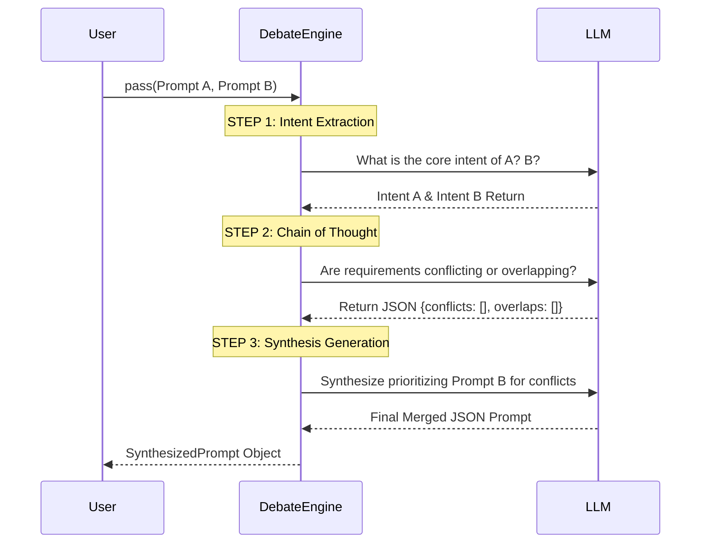
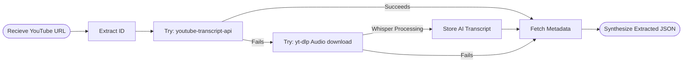

# Omni Browser Agent - Architecture & Documentation

## 🌟 Product Purpose & Overview
 Omni Browser Agent is an autonomous, AI-driven browser infrastructure designed to intelligently execute web automation tasks, conduct deep internet research, and extract multimodal content across major social media platforms. 
 
Unlike standard scrapers, it uses intelligent routing, chain-of-thought prompt synthesis (via a built-in Debate Engine), and LLM-powered context awareness.

### Key Capabilities
- **Autonomous Browsing:** Uses AI/LLM-controlled **Playwright** agents to navigate dynamically.
- **Multimodal Content Extraction:** Safely extracts texts, videos, and transcripts directly from YouTube, Instagram, LinkedIn, and Twitter.
- **Intent-Based Routing:** Uses Natural Language Processing to detect user intent and map arbitrary prompts to the proper pipeline execution logic.
- **Prompt Debate Engine:** Automatically refines ambiguous or conflicting prompts by generating an LLM-vs-LLM debate, creating unified and synthesized instructions.
- **Extensible Configuration:** Fully configurable via a master YAML profile containing stealth configurations, wait-delays, inference temperatures, etc.

---

## 🏗️ System Architecture 

The Agent is built with a decoupled, asynchronous Python architecture.

### Folder & Module Breakdown
- **`main.py`**: The CLI endpoint handling multi-mode bootstrapping (`task`, `server`, `batch`, `debate`).
- **`core/config.yaml`**: The brain's single source of truth configuration (vision models, headless mode, timeouts, etc.).
- **`agents/crew.py`**: Orchestrates `OmniBrowserAgent` logic, acting as the primary orchestrator that delegates execution paths based on inputs.
- **`pipeline/task_router.py`**: A chain of responsibility determining which underlying subsystem handles the prompt. Analyzes NLP content to route correctly.
- **`pipeline/extractor.py`**: Specialized parsers inheriting from `BaseExtractor` handling complex domain scraping logic for YouTube, IG, LinkedIn, Twitter.
- **`engine/debate.py`**: A conflict resolution LLM loop to synthesize instructions. 
- **`browser/`**: Abstracted wrapper around headless Playwright allowing intelligent, human-like interaction.
- **`api/`**: A FastAPI layer to turn this agent into a long-living RESTful service backend.

---

## 🚦 Workflows & Process Diagrams

### 1. The Request Routing Workflow
When a task starts, the `TaskRouter` handles natural language strings by progressively matching text intents. 

### 2. Prompt Synthesis & Debate Engine
A highly intelligent component that deduplicates or merges contradicting rules using a red-team/blue-team strategy.

### 3. YouTube Extraction Waterfall
Demonstration of failure resiliency. The agent attempts 3 extraction methodologies dynamically:

---

## 🛡️ Built-in Failsafes and Security
- **Dynamic Headless Modes**: `core/config.yaml` lets you easily toggle headless off for debugging (`headless: false`). 
- **Graceful Fault Tolerance**: Extractor pipelines fallback to basic metadata retrieval if rigorous content extraction (e.g. video transcripts) fails. 
- **Security Scans**: The project uses an abstract layer structure that limits prompt-injection risks in the router logic. Check `task_router.py`, where NLP is segregated.

## 🧑‍💻 How to use the API / CLI
- **Execute a Task**: `python main.py task "Find the latest post on X.com about AI"` 
- **Start the Engine Server**: `python main.py server --port 8000` (Deploys FastAPI context)
- **Run the Debate Engine**: `python main.py debate "Use selenium to scrape" "Use playwright to scrape without being slow"` 
